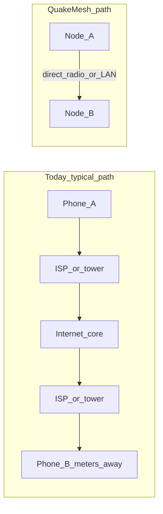

# Philosophy — Why QuakeMesh

## The promise we started with

The early internet was built with a specific kind of resilience in mind. Its
designers — working in an era when nuclear strike survivability was a real
constraint — wanted a network that could lose nodes and keep working. Routes
would find another path. Communication would continue.

That spirit outlived the Cold War. For decades, the defining property of the
internet was **end-to-end connectivity**: any host on the network could, in
principle, reach any other host. The network was the medium. It was not a
gatekeeper standing between you and the person you wanted to talk to.

And people used that freedom inventively. I remember watching someone's coffee
machine brew over the network — not because anyone needed remote caffeine
telemetry, but because you *could*, and that was exciting. People built strange,
wonderful, personal things and put them where others could find them. The
internet was a place to experiment, to share a life, to connect with strangers
who turned out to share your obsessions.

That was the promise: a network that belonged to its participants, that
survived disruption, and that made reach itself feel like a kind of magic.

---

## What connection felt like before the gatekeepers

In the late 1980s and early 1990s I ran a dial-up bulletin board system from
my flat in Durban. I was thrilled when real people started calling in — to
upload and download files, to leave messages on the boards, to argue about
things that mattered to them. It was small. It was local. It was *mine*, in the
sense that I operated it, and people connected directly to it.

Then the networks started opening up. Systems like iLink and FidoNet let local
BBS messages propagate across the country, and eventually across the world —
all carried by enthusiastic hobbyists on dial-up lines, node to node, with no
central authority deciding who could speak to whom.

I still remember the first time I used a telnet account to connect to the New
York Public Library. I had no intention of using the library. I was excited
simply because I *could* — because a machine in my flat could reach a service
on the other side of the planet, and the path between us was the network itself.

Through BBSs and early chat groups in the 90s I made friends who became
lifelong friends. The internet brought disparate people together around shared
interests and passions in a way that had never been possible before. You were
not just consuming content someone else had packaged for you. You were a
participant. You hosted. You relayed. You belonged.

---

## The turn — from participants to consumers

Something shifted as the internet matured.

Commercialization made connection easier for millions of people, and that is
genuinely good. Email, the web, streaming, mobile apps — these are real gains.
But the underlying architecture inverted. Internet service providers and mobile
carriers became **mandatory intermediaries**. The "Wild West" feeling faded.
Today almost everyone connects through an ISP or a mobile data provider, and
most people have become pure consumers of connectivity rather than providers of
it.

The technical capstone of that shift is **CGNAT** — carrier-grade network
address translation. On most residential and virtually all mobile connections,
your device sits behind layers of NAT. You can initiate outbound connections,
but strangers cannot initiate connections to you. Most mobile users cannot run
their own services at all. Applications talk to central servers; peers do not
talk to peers. The internet still works beautifully for the patterns it was
commercialized around. It stopped working for the patterns it was *born* around.

| Then | Now |
|---|---|
| Your machine was a peer on the network | Your device is a client behind NAT |
| You hosted; others connected to you | You consume; providers host for you |
| Local and global were the same abstraction | "Local" traffic often hairpins through the internet |

We have become dependent on telco-style infrastructure in a way the original
internet was explicitly designed to avoid.

---

## The failure mode — when infrastructure is the whole network

The problem is not that ISPs exist. The problem is that **we have no fallback
when they disappear**.

A power failure takes out your router. A fibre line is cut. A cell tower
collapses. In each case, your connection is gone — not partially degraded, but
gone entirely. And here is the absurdity: you often cannot communicate with
someone **physically beside you**, because all traffic is routed out through
your provider and back, even when the destination is meters away.

This is not a theoretical concern. In a disaster environment — an earthquake, a
flood, a wildfire — infrastructure fails first and hardest. Someone trapped in
a collapsed building three meters from a rescuer may have a working phone in
their pocket and still be unable to send a message, because the cell tower is
down. The device works. The **architecture** does not.

The same structural dependency shows up outside headline disasters: everyday
outages, rural dead zones, censorship, cost barriers, and situations where you
simply cannot trust or afford the path through a central provider. We have
wired ourselves into a single point of failure and called it progress.

---

## What QuakeMesh is trying to reclaim

QuakeMesh exists to restore a property we lost: **the ability to communicate and
run services when infrastructure is absent or untrusted**.

This is not an argument against the modern internet. The public internet
remains enormously valuable. QuakeMesh is not anti-cloud and not anti-ISP. It
is a parallel capability — a mesh that works without them, and that uses them
only when you explicitly choose to.

The model is closer to the world I knew on FidoNet than to today's app
ecosystem: every node is both an **endpoint and a repeater**. The network is
carried by the people in it. Your phone does not just consume connectivity; it
extends it to your neighbors. Messages hop across devices. Routes form and
reform as people move. When a path breaks, traffic finds another way — or
waits in a store-and-forward queue until one appears.

Internet access, when available, is a **deliberate, visible fallback** — never
the silent default. Local radios and connected Wi-Fi LANs are first-class paths.
A conversation with someone in the next room should not leave the building.

---

## Principles

These are the convictions that shape every design decision in QuakeMesh. The
engineering detail lives in [plan.md](plan.md); this is the *why* behind it.

| Principle | What it means |
|---|---|
| **Infrastructure-independent first** | Works with zero cloud, zero central server, and zero pre-existing internet access |
| **Peers, not clients** | Nodes route for each other; you are part of the network, not just a user of it |
| **Local before global** | Bluetooth, Wi-Fi Direct, and connected LAN are first-class; neighbor-to-neighbor traffic does not hairpin through the internet |
| **Graceful degradation** | Store-and-forward, multi-hop routing, and re-discovery — the network bends, it does not snap |
| **Explicit trust** | An open mesh without open abuse; trust scores and endorsements reflect physical-world accountability |
| **Opt-in escape hatch** | Internet fallback exists for when you choose it — never silently |

QuakeMesh is for disaster responders who need communications when towers are
down. For off-grid communities who should not have to rent connectivity from a
distant provider to talk to each other. For privacy-conscious groups who want a
network they control. For hobbyists who miss building things that *are* the
network, not things that sit on top of someone else's. And for developers who
want mesh transport without a platform middleman standing between their users.

---

## Acknowledgements — standing on shoulders

QuakeMesh owes everything to the people who went before — not only for the
technical building blocks this project assembles, but for the culture of
**shared experience, discovery, and innovation** that made any of this seem
worth attempting in the first place.

The philosophy is inherited from the BBS sysops who stayed up all night so
strangers could connect, from FidoNet and iLink volunteers who relayed messages
across continents on dial-up budgets, and from everyone who ever put something
on the network just to see if anyone would find it — the coffee-pot webcam, the
odd telnet service, the message board thread that turned into a twenty-year
friendship. QuakeMesh is an attempt to carry that spirit forward: participate,
relay, discover, build — not merely consume.

The technical debt is just as real, and equally gratefully acknowledged:

| Inspiration | What QuakeMesh takes from it |
|---|---|
| **The early internet / ARPANET design** | Survivable, decentralized routing; end-to-end connectivity as a first principle |
| **FidoNet, BBS networks, and store-and-forward messaging** | The mental model of hobbyist-operated nodes that relay for each other across unreliable links |
| **[BATMAN-adv](https://www.open-mesh.org/projects/batman-adv/)** | Originator Messages (OGMs), bidirectional link quality (`TQ = EQ / RQ`), and routing that avoids full-topology floods under churn |
| **[Meshrabiya](https://github.com/UstadMobile/Meshrabiya)** (UstadMobile) | Multi-hop Wi-Fi on stock Android via Local Only Hotspot + Wi-Fi Direct — the blueprint for high-bandwidth P2P transport without root |
| **Noise Protocol / [WireGuard](https://www.wireguard.com/)** | Per-hop authenticated encryption on every radio and LAN link |
| **[QUIC](https://www.rfc-editor.org/rfc/rfc9000)** / [quic-go](https://github.com/quic-go/quic-go) | Internet-fallback transport: TLS 1.3, multiplexing, and survival across IP address changes |
| **[libp2p](https://libp2p.io/) DCUtR** | Synchronized NAT hole-punch timing for direct peer paths when internet fallback is in use |
| **STUN / TURN** (conceptual lineage) | Hub rendezvous and relay-fallback patterns for peers behind NAT and CGNAT |
| **[RFC 9171](https://www.rfc-editor.org/rfc/rfc9171) (Bundle Protocol)** | Store-and-forward DTN semantics when no live route exists |
| **Ed25519** | Self-sovereign node identity without a central certificate authority |
| **Protocol Buffers** | Compact, typed wire schemas shared across Go and Kotlin |
| **[modernc.org/sqlite](https://modernc.org/sqlite)** | Pure-Go SQLite that runs on Android through gomobile without cgo |

None of these projects are endorsed by or affiliated with QuakeMesh. We cite
them because good ideas compound — and because the people behind them, like
the sysops and hobbyists of an earlier era, chose to build in the open and let
others stand on their work.

---

## The name, and an invitation

**QuakeMesh** is named for networks that survive the quake — literally, when
the ground shakes and conventional infrastructure fails; and figuratively, when
the assumptions we built on (that connectivity must flow through a provider,
that peers cannot host, that local is just a special case of global) are shaken
loose.

If this resonates — if you remember what it felt like when reach itself was the
point, or if you have simply noticed that the person next to you is unreachable
when the tower goes dark — read [plan.md](plan.md) for the engineering path,
and consider contributing. QuakeMesh is an attempt to build back what mattered
about the early internet, with the tools we have now: modern cryptography,
mobile hardware, and the lesson that a network should keep working when
everything else stops.
