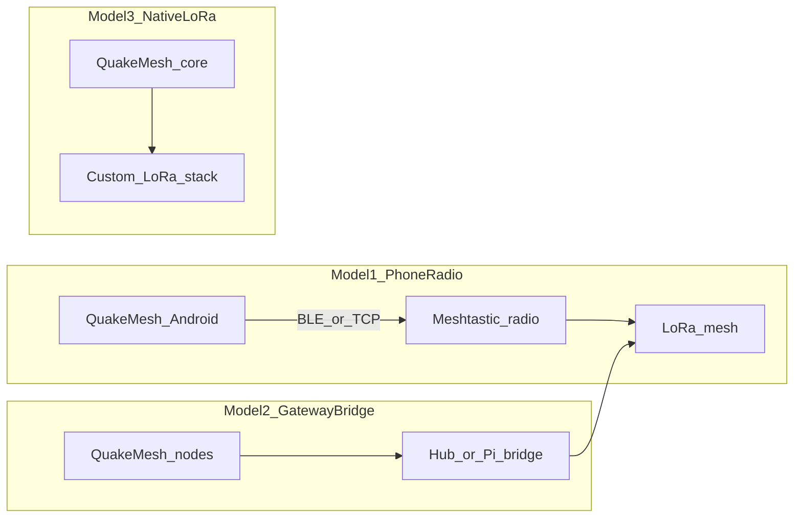

# Future: Meshtastic / LoRa integration

**Status:** future work — not implemented.

QuakeMesh has no LoRa or Meshtastic code today. Adding sub-GHz reach means
**bridging two mesh systems** (QuakeMesh `Frame` envelopes and Meshtastic
`MeshPacket` payloads), not flipping a configuration flag. The authoritative
design document remains [/plan.md](../plan.md); this note captures options and
effort for when the work is prioritised.

---

## What Meshtastic is

Meshtastic is three layers:

1. **Hardware** — LoRa radios (T-Beam, Heltec, RAK, etc.) running Meshtastic
   firmware on sub-GHz bands.
2. **Over-the-air protocol** — compact binary packet headers plus encrypted
   protobuf payloads; practical air payload is on the order of **~237 bytes**
   per hop.
3. **Phone link** — BLE, TCP, or USB “PhoneAPI” to the radio. The official
   [Meshtastic Kotlin SDK](https://github.com/meshtastic/meshtastic-sdk)
   (`sdk-core`, `sdk-transport-ble`, minSdk 26) handles handshake, NodeDB, and
   channel decryption.

### QuakeMesh contrast

| Area | QuakeMesh today |
|------|-----------------|
| Wire format | [`proto/frame.proto`](../proto/frame.proto) — `quakemesh.wire.Frame` with 32-byte node IDs, TTL, `transport_hints`, Noise-sealed payload |
| Android transports | [`Transport.kt`](../android/app/src/main/java/net/quakemesh/android/transport/Transport.kt) plugins wired through [`MeshEngine.kt`](../android/app/src/main/java/net/quakemesh/android/mesh/MeshEngine.kt) |
| Hub backbone | OGM UDP, HTTP heartbeat, LAN beacons — separate from device P2P routing |
| Device routing | [`core/mobile/mobile.go`](../core/mobile/mobile.go) accepts frames; full multi-hop forwarding is still early-phase |

---

## Current state in QuakeMesh

### Exists

- Kotlin `Transport` interface and `MeshEngine` lifecycle (inbound →
  `MeshNode.onFrameReceived`, outbound → `dispatchOutbound` fan-out).
- `transport_hints` on `Frame` proto — room for a `"lora"` hint.
- LAN infrastructure segments in Monitor (segment + members model).
- Hub registry and Android HTTP heartbeat path.

### Missing

- Any LoRa/Meshtastic references in source.
- Real multi-hop frame routing in the Go mobile node.
- **Transport-selective outbound routing** — today every transport receives
  every `send()` call.
- Node ID mapping (QuakeMesh 32-byte hex vs Meshtastic `NodeNum`).
- Fragmentation for sub-237-byte air limits.
- Hub-side Meshtastic bridge service.

---

## Integration models

Three approaches, documented with equal weight. None is implemented.

### Model 1 — Meshtastic radio as QuakeMesh transport

Phone (or hub-attached host) connects to a Meshtastic device over BLE/TCP via
the official SDK. A new `MeshtasticTransport` implements the existing
`Transport` interface.

**Packet flow:** QuakeMesh `Frame` bytes are tunnelled inside a Meshtastic
`MeshPacket` on a private `PortNum` (application port). Meshtastic handles LoRa
hops; QuakeMesh treats the radio mesh as a reachability layer.

| Pros | Cons |
|------|------|
| Reuses proven LoRa stack and hardware ecosystem | Meshtastic packet size, speed, and channel-key constraints |
| No custom RF firmware | Dual crypto if not tunnelled carefully |

### Model 2 — Gateway bridge

An always-on bridge (hub process or Pi + radio) joins QuakeMesh Wi‑Fi/LAN mesh
to a Meshtastic LoRa mesh. Non-radio phones reach LoRa nodes via the bridge.

| Pros | Cons |
|------|------|
| Phones do not need Meshtastic hardware | Bridge availability; new bridge software |
| Fits Monitor “segment + members” pattern | Operational coupling between networks |

### Model 3 — Native LoRa in QuakeMesh

Custom sub-GHz transport with QuakeMesh framing, Noise crypto, and OGM routing
on dedicated hardware (SX126x, etc.).

| Pros | Cons |
|------|------|
| Single protocol and identity model | Months of firmware work; no Meshtastic interop |

---

## Protocol mismatches to resolve

| Area | QuakeMesh | Meshtastic | Likely approach |
|------|-----------|------------|-----------------|
| Node identity | 32-byte SHA-256 `NodeID` (hex) | 32-bit `NodeNum` + long name | Registry mapping table (hub DB) |
| Crypto | Noise per-hop + E2E to destination | Channel PSK + optional PKI DMs | Tunnel QuakeMesh ciphertext inside Meshtastic payload |
| Packet size | Flexible protobuf frames | ~237 B air payload | Fragmentation / reassembly layer |
| Throughput | Wi‑Fi/LAN oriented | Seconds per hop | Priority queue; do not route bulk DTN over LoRa by default |
| Routing | Userspace OGM/TQ (BATMAN-inspired) | Meshtastic flood + router roles | Transport selection via `transport_hints`; separate routing planes |
| Outbound | `MeshEngine.dispatchOutbound` fans out to all transports | Must target LoRa only for LoRa peers | **Prerequisite:** routing-aware `send()` |

---

## Key integration points

| Area | Path |
|------|------|
| Design authority | [plan.md](../plan.md) — Transport Layer |
| Android transport API | [Transport.kt](../android/app/src/main/java/net/quakemesh/android/transport/Transport.kt) |
| Mesh orchestration | [MeshEngine.kt](../android/app/src/main/java/net/quakemesh/android/mesh/MeshEngine.kt) |
| Go ↔ Kotlin bridge | [GoMeshNode.kt](../android/app/src/main/java/net/quakemesh/android/mesh/GoMeshNode.kt), [core/mobile/mobile.go](../core/mobile/mobile.go) |
| Frame proto | [proto/frame.proto](../proto/frame.proto) |
| Hub presence (Android → Hub) | [MeshPresenceReporter.kt](../android/app/src/main/java/net/quakemesh/android/mesh/MeshPresenceReporter.kt) |
| Monitor infrastructure pattern | [core/lansegments/](../core/lansegments/), Monitor `/api/infrastructure` |
| External SDK | [meshtastic/meshtastic-sdk](https://github.com/meshtastic/meshtastic-sdk) |

---

## Phased effort estimate

Non-binding planning figures only.

| Phase | Scope | Effort |
|-------|--------|--------|
| **0 — Spike** | SDK connect over BLE; send/receive on a private `PortNum` | 1–2 weeks |
| **1 — Android transport** | `MeshtasticTransport`, basic QuakeMesh frame tunnel | 2–4 weeks |
| **2 — Routing hook** | Transport selection, `"lora"` hint, rate limits | 3–6 weeks |
| **3 — Hub bridge** | Go bridge service, registry mapping, Monitor segment | 2–4 weeks |
| **4 — Hardening** | Fragmentation, SOS priority, channel config, coexistence with existing Meshtastic meshes | 4+ weeks |

**Hardware for development:** at least two Meshtastic devices on the same
channel plus a physical Android phone. Emulators cannot exercise BLE or LoRa.

---

## Open questions

- Private Meshtastic channel vs joining an existing community mesh.
- Where node-ID mapping lives in the hub schema.
- Whether SOS and DTN may use LoRa by default or only as an explicit fallback.
- Bridge deployment: hub process vs standalone Pi service.
- Coexistence policy when a phone is on both Wi‑Fi/LAN and connected to a
  Meshtastic radio.

---

## Related docs

- [plan.md](../plan.md)
- [docs/protocol-spec.md](protocol-spec.md)
- [android/README.md](../android/README.md)
- [docs/Future-openMANET.md](Future-openMANET.md) — complementary Wi‑Fi HaLow MANET path
