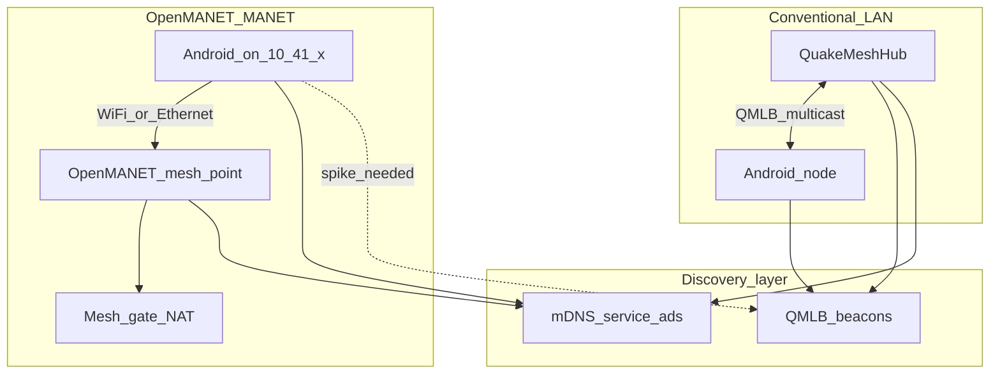

# Future: OpenMANET / Wi-Fi HaLow MANET integration

**Status:** future work — not implemented.

[OpenMANET](https://openmanet.github.io/docs/) is a Raspberry Pi–based MANET
built on Wi-Fi HaLow (802.11ah) with kernel **802.11s + BATMAN-V** routing, a
flat **`10.41.0.0/16`** client network, and **mDNS** service discovery. QuakeMesh
today uses **application-layer** BATMAN-*inspired* OGM routing and **custom**
QuakeMesh LAN beacons — not kernel `batman-adv` and **not mDNS**. Integration
is complementary at the discovery and transport layers, not a protocol merge.

---

## What OpenMANET is

Summary from the [OpenMANET documentation](https://openmanet.github.io/docs/networking):

- **Hardware:** Raspberry Pi + Wi-Fi HaLow HAT (e.g. Seeed), OpenWrt-based images.
- **Mesh routing:** 802.11s mesh link layer + **BATMAN-V** (batman-adv family) on
  interface `bat0`.
- **Client network:** flat **`10.41.0.0/16`**; each mesh point runs local DHCP and
  a unique 2.4/5 GHz AP. End-user devices join via Ethernet or Wi-Fi and receive
  a `10.41.x.x` address.
- **Discovery:** **mDNS** (`hostname.local`) and service announcements across the
  mesh.
- **Management:** `openmanetd` daemon — ALFRED-based internal node gossip,
  ConnectRPC/gRPC API on port **8087**, gateway and position workers.

### QuakeMesh contrast

| Area | QuakeMesh | OpenMANET |
|------|-----------|-----------|
| Routing | Userspace OGM/TQ over UDP ([`core/routing/`](../core/routing/routing.go)) | Kernel BATMAN-V on `bat0` |
| Client IP model | Application endpoints; LAN uses conventional DHCP | Flat `10.41.0.0/16` for all clients |
| Discovery | Custom QMLB UDP multicast beacons | mDNS + `openmanetd` ALFRED gossip |
| Phone mesh | Meshrabiya / BLE / LAN transports on stock Android | Android joins as IP client on mesh AP |
| Philosophy | BATMAN-*inspired* metrics in userspace | BATMAN-adv in kernel |

The routing designs are philosophically similar but **not interoperable**. The
practical approach is to treat an OpenMANET attachment as an **IP/LAN transport
segment**, not to merge OGM with `bat0`.

---

## QuakeMesh discovery today

**QuakeMesh does not implement mDNS today.** Discovery uses:

| Mechanism | Where | Details |
|-----------|-------|---------|
| **QMLB multicast beacons** | [`core/lanbeacon/`](../core/lanbeacon/), [`hub/internal/landiscovery/`](../hub/internal/landiscovery/landiscovery.go), [`LanUdpTransport.kt`](../android/app/src/main/java/net/quakemesh/android/transport/LanUdpTransport.kt) | UDP `239.255.42.99:47223`, magic `QMLB` + JSON (`kind`: hub/node, `node_id`, ports, optional `lan_context`) |
| **HTTP heartbeat** | [`MeshPresenceReporter.kt`](../android/app/src/main/java/net/quakemesh/android/mesh/MeshPresenceReporter.kt), [`hub/internal/nodeheartbeat/`](../hub/internal/nodeheartbeat/) | `POST /v1/heartbeat` after hub base URL is known |
| **OGM backbone** | [`hub/internal/ogmengine/`](../hub/internal/ogmengine/) | Separate UDP port (default 47222) for hub-to-hub sync |
| **LAN segments** | [`core/lansegments/`](../core/lansegments/), Monitor `/api/infrastructure` | Wi-Fi segment = gateway IP + SSID/BSSID + member node/hub IDs |

OpenMANET operators expect **`hubname.local`**-style reachability on `10.41.x.x`.
QuakeMesh expects **QMLB multicast** on the same broadcast domain. These can
**coexist** on a conventional LAN but are **not interchangeable** on a MANET
until validated (see Phase 2 spike below).

---

## Impact on QuakeMesh

### Low impact (additive)

- **mDNS on the hub** announcing QuakeMesh services — helps conventional LAN
  *and* OpenMANET clients find the hub without manual IP entry.
- **Android NSD browse** as a fallback when QMLB multicast is blocked, slow, or
  absent.
- **Monitor “MANET segment”** — extend the existing infrastructure model (like
  Wi-Fi LAN segments) for `10.41.0.0/16` members.

### Medium impact

- **Hub on OpenMANET hardware** — run QuakeMeshHub on an OpenMANET Pi; bind
  `landiscovery` and heartbeat to `bat0`; `lancontext.Detect()` already
  collects gateway/SSID where available.
- **Android as OpenMANET client** — phone joins a mesh-point AP, gets
  `10.41.x.x`; existing `LanUdpTransport` may work **if** QMLB multicast
  propagates across BATMAN-V (field spike required).
- **Dual discovery** — QMLB + mDNS in parallel; dedupe resolved hub URLs by
  `node_id`.

### High impact (architectural)

- **Kernel MANET on stock Android phones** — OpenMANET’s model requires Linux +
  batman-adv; not available without root/custom ROM. Phone-to-phone mesh stays
  on Meshrabiya/BLE/LAN.
- **Merging OGM with batman-adv** — two routing planes; use IP bridging instead.
- **Shipping full OpenMANET inside QuakeMesh** — OpenWrt images, HaLow drivers,
  `openmanetd` — a separate deployment artifact, not the Android app.

---

## Integration models

### Model A — mDNS alongside QMLB

Hub (and optionally Android) publishes and consumes DNS-SD records. QMLB
beacons remain unchanged.

| Pros | Cons |
|------|------|
| Familiar to OpenMANET operators; works on many LANs | Two discovery mechanisms to maintain |
| No MANET hardware required for initial rollout | mDNS across VLANs and some APs is inconsistent |

### Model B — Hub on OpenMANET node

QuakeMeshHub runs on a Pi mesh point; discovery and heartbeat bind to `bat0`.

| Pros | Cons |
|------|------|
| Field-deployable HaLow backbone | ARM/OpenWrt packaging |
| Aligns with OpenMANET operational model | Multicast and mDNS on `bat0` must be validated |

### Model C — Android client on OpenMANET

Phone joins mesh AP; uses existing LAN transport plus mDNS browse for hub URL.

| Pros | Cons |
|------|------|
| Operators already carry phones on MANET | QMLB multicast may not traverse BATMAN-V |
| Reuses `LanUdpTransport` and heartbeat path | Discovery needs mDNS fallback |

### Model D — Gateway bridge

Mesh gate NATs the MANET to an upstream LAN where a conventional hub runs.

| Pros | Cons |
|------|------|
| Hub stays on normal Linux/macOS/Windows | Two networks; identity path is indirect |
| Minimal change to hub software | Routing policy vs internet-fallback needs clarity |

---

## mDNS on the hub — design sketch

### Publish (hub)

- **Service type:** `_quakemesh-hub._tcp.local`
- **Port:** heartbeat HTTP port (from `-heartbeat-addr`)
- **TXT records:** `node_id`, `ogm_port`, `version`, optional `gateway` / `ssid`
  from `lan_context`

Suggested Go package: `hub/internal/mdnsdiscovery`, started from
[`hubapp.go`](../hub/internal/hubapp/hubapp.go) alongside existing
[`landiscovery`](hub/internal/landiscovery/landiscovery.go). Library candidates:
`github.com/grandcat/zeroconf` or `hashicorp/mdns`.

### Browse (Android)

- Use `NsdManager` to resolve `_quakemesh-hub._tcp` when `discoveredHubUrl` is
  empty and QMLB has not produced a hub within a timeout.
- Feed the resolved `http://host:port` into existing
  [`MeshEngine.prepareStart()`](../android/app/src/main/java/net/quakemesh/android/mesh/MeshEngine.kt)
  and [`MeshPresenceReporter`](android/app/src/main/java/net/quakemesh/android/mesh/MeshPresenceReporter.kt).

### Coexistence with QMLB

Both mechanisms answer “where is the hub?”. Registry and
[`MeshDiscovery`](android/app/src/main/java/net/quakemesh/android/mesh/MeshDiscovery.kt)
should **dedupe by `node_id`**, not treat duplicate announcements as separate
hubs.

---

## Alignment with current discovery

### Reuses without change

- `lanbeacon` wire format and `landiscovery` ingest loop (on any interface where
  multicast works).
- `MeshPresenceReporter` / `nodeheartbeat` once hub base URL is known.
- `lan_segments` schema and Monitor infrastructure graph.
- Hub registry, trust engine, Monitor WebSocket events.

### New work

- mDNS advertise (hub) and browse (Android).
- Interface binding policy when the hub is multi-homed (`eth0` vs `bat0` vs
  `wlan0`).
- OpenMANET-flavoured segment metadata in Monitor (optional `10.41.0.0/16`
  gateway marker).
- **Spike:** QMLB multicast `239.255.42.99` reachability across BATMAN-V.
- Optional: read-only client for `openmanetd` ConnectRPC (`:8087`) to import
  neighbor lists into Monitor for ops visibility.

---

## Phased effort estimate

| Phase | Scope | Effort |
|-------|--------|--------|
| **0 — Discovery spike** | mDNS publish on hub; Android NSD browse; verify on conventional LAN | ~1 week |
| **1 — Dual discovery** | Integrate mDNS into hub startup and Android hub URL resolution; dedupe with QMLB | 1–2 weeks |
| **2 — OpenMANET lab** | Hub on Pi mesh point; test QMLB + heartbeat + mDNS over `bat0` | 2–3 weeks |
| **3 — Infrastructure UI** | MANET segment in Monitor; reuse manual GPS pin pattern from hub/LAN migrations | ~1 week |
| **4 — openmanetd integration** | Optional neighbor import via `:8087` API | 2+ weeks |

**Hardware:** OpenMANET-compatible Pi + HaLow HAT (or access to an existing
mesh), Android phone, and a conventional Wi-Fi LAN for baseline comparison tests.

---

## Open questions

- Does QMLB multicast `239.255.42.99` propagate on OpenMANET `bat0`?
- Should QuakeMeshHub run **on** OpenMANET nodes or only **behind** a mesh gate?
- mDNS service naming and collision avoidance with `openmanetd` services.
- OGM bind address when the hub has both upstream LAN and `10.41.x.x` on `bat0`.
- Policy when a mesh gate provides upstream internet — relationship to QuakeMesh
  internet-fallback gating.

---

## Related docs

- [plan.md](../plan.md) — LAN transport, routing metric, infrastructure
- [hub/README.md](../hub/README.md) — `-discovery-bind`, `-heartbeat-addr`
- [docs/Future-LoRa.md](Future-LoRa.md) — complementary long-range transport
- [OpenMANET networking](https://openmanet.github.io/docs/networking)
- [openmanetd daemon](https://openmanet.github.io/docs/openmanetd)
